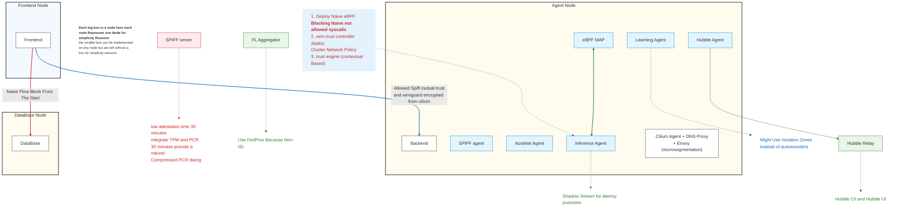

```mermaid
graph TB
    %% --- GLOBAL STYLES & CONFIG ---
    HeaderNote["<b>Each big box is a node here each node Represent one Node for simplicity Reasons</b><br>the smaller box can be implemented on any node but are left without a box for simplicity reasons"]
    style HeaderNote fill:none,stroke:none,text-align:left,font-size:12px;

    %% --- NODE 1: FRONTEND ---
    subgraph FrontendNode ["Frontend Node"]
        Frontend["Frontend"]
    end
    style FrontendNode fill:#f4f9ff,stroke:#333,stroke-width:2px;
    style Frontend fill:#fff,stroke:#333,stroke-width:1px;

    %% --- NODE 2: AGENT / BACKEND NODE ---
    subgraph AgentNode ["Agent Node"]
        direction TB
        ebpfMap["eBPF MAP"]
        InferenceAgent["Inference Agent"]
        LearningAgent["Learning Agent"]
        SPIFFAgent["SPIFF agent"]
        AuraNetAgent["AuraNet Agent"]
        HubbleAgent["Hubble Agent"]
        Backend["Backend"]
        CiliumAgent["Cilium Agent + DNS Proxy<br>+ Envoy (microsegmentation)"]
    end
    style AgentNode fill:#fffbee,stroke:#333,stroke-width:2px;
    style ebpfMap fill:#e1f5fe,stroke:#0288d1,stroke-width:1px;
    style InferenceAgent fill:#e1f5fe,stroke:#0288d1,stroke-width:1px;
    style LearningAgent fill:#e1f5fe,stroke:#0288d1,stroke-width:1px;
    style SPIFFAgent fill:#e1f5fe,stroke:#0288d1,stroke-width:1px;
    style AuraNetAgent fill:#e1f5fe,stroke:#0288d1,stroke-width:1px;
    style HubbleAgent fill:#e1f5fe,stroke:#0288d1,stroke-width:1px;
    style Backend fill:#fff,stroke:#333,stroke-width:1px;
    style CiliumAgent fill:#fff,stroke:#333,stroke-width:1px;

    %% --- NODE 3: DATABASE ---
    subgraph DataBaseNode ["DataBase Node"]
        DataBase["DataBase"]
    end
    style DataBaseNode fill:#fffbee,stroke:#333,stroke-width:2px;
    style DataBase fill:#fff,stroke:#333,stroke-width:1px;

    %% --- EXTERNAL COMPONENTS ---
    HubbleRelay["Hubble Relay"]
    SPIFFServer["SPIFF server"]
    FLAggregator["FL Aggregator"]
    
    style HubbleRelay fill:#e8f5e9,stroke:#2e7d32,stroke-width:1px;
    style SPIFFServer fill:#ffebee,stroke:#c62828,stroke-width:1px;
    style FLAggregator fill:#e8f5e9,stroke:#2e7d32,stroke-width:1px;

    %% --- ANNOTATIONS & FLOATING NOTES ---
    Note_Isolation["Might Use Isolation Zones instead of autoencoders"]
    style Note_Isolation fill:none,stroke:none,color:#1565c0,text-align:left;

    Note_Shadow["Shadow Stream for latency purposes"]
    style Note_Shadow fill:none,stroke:none,color:#2e7d32,text-align:left;

    Note_Deploy["1. Deploy Naive eBPF<br><b>Blocking Naive not allowed syscalls</b><br>2. zero trust controller deploy<br>Cluster Network Policy<br>3. trust engine (contextual Based)"]
    style Note_Deploy fill:#e3f2fd,stroke:none,color:#c62828,text-align:left;

    Note_HubbleCli["Hubble Cli and Hubble UI"]
    style Note_HubbleCli fill:none,stroke:none,color:#2e7d32,text-align:left;

    Note_SPIFF["low attestation time 30 minutes<br>integrate TPM and PCR<br>30 minutes provide a natural<br>Comprimised PCR dieing"]
    style Note_SPIFF fill:none,stroke:none,color:#c62828,text-align:left;

    Note_FedProx["Use FedProx Because Non-IID"]
    style Note_FedProx fill:none,stroke:none,color:#2e7d32,text-align:left;

    %% --- CONNECTIONS & RELATIONSHIPS ---
    Frontend --> |"Allowed Spiff mutual trust<br>and wireguard encrypted from cilium"| Backend
    linkStyle 0 stroke:#1565c0,stroke-width:2px;

    Frontend --> |"Naive Flow Block From The Start"| DataBase
    linkStyle 1 stroke:#c62828,stroke-width:2px;

    ebpfMap <--> InferenceAgent
    linkStyle 2 stroke:#2e7d32,stroke-width:2px;

    InferenceAgent -.-> Note_Shadow
    linkStyle 3 stroke:#2e7d32,stroke-width:1px,stroke-dasharray: 3 3;

    LearningAgent -.-> Note_Isolation
    linkStyle 4 stroke:#1565c0,stroke-width:1px,stroke-dasharray: 3 3;

    Note_Deploy -.-> InferenceAgent
    linkStyle 5 stroke:#1565c0,stroke-width:1px;

    HubbleAgent --> HubbleRelay
    linkStyle 6 stroke:#2e7d32,stroke-width:1px;

    HubbleRelay -.-> Note_HubbleCli
    linkStyle 7 stroke:#2e7d32,stroke-width:1px;

    SPIFFServer -.-> Note_SPIFF
    linkStyle 8 stroke:#c62828,stroke-width:1px;

    FLAggregator -.-> Note_FedProx
    linkStyle 9 stroke:#2e7d32,stroke-width:1px;
```

