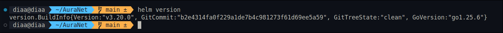

# auranet-loader

> Lightweight eBPF syscall tracer — compiles and loads on every Kubernetes node, dumps structured JSON events to the host filesystem.

---


### Why compile on-node?

The eBPF bytecode depends on the running kernel version and its BTF (BPF Type Format) layout. Compiling against the node's own headers avoids shipping a pre-built `.o` that might mismatch the actual kernel — no CO-RE (Compile Once – Run Everywhere) infrastructure required.

---


## Output format

Each line is a compact JSON object:

**sys_enter**
```json
{"ts":"2025-06-01T12:34:56.789012+00:00","ts_ns":1748779496789012345,"type":"enter","pid":4242,"tgid":4242,"uid":1000,"gid":1000,"comm":"curl","syscall_nr":42,"syscall":"connect","args":[3,140234567890,16,0,0,0]}
```

**sys_exit**
```json
{"ts":"2025-06-01T12:34:56.789099+00:00","ts_ns":1748779496789099000,"type":"exit","pid":4242,"tgid":4242,"uid":1000,"gid":1000,"comm":"curl","syscall_nr":42,"syscall":"connect","ret":0}
```

---

## Prerequisites

### Node requirements
- Linux kernel **≥ 5.8** (BPF ring buffer)
- Kernel headers installed on each node: `linux-headers-$(uname -r)`
  - Ubuntu/Debian: `apt-get install linux-headers-$(uname -r)`
  - Amazon Linux 2/RHEL: `yum install kernel-devel`
- `/sys/kernel/btf/vmlinux` present (`CONFIG_DEBUG_INFO_BTF=y`)

### Helm
- Helm **3.x**
- Cluster nodes with kernel headers at `/usr/src` or `/lib/modules/<kver>/build`


---

## Build the images

```bash
# Builder image (clang + build script)
docker build -f Dockerfile.builder -t auranet-builder:0.2.0 .


# Loader image (python3 + BCC)
docker build -f Dockerfile.loader -t auranet-loader:0.2.0 .

```

---

## Deploy with Helm

```bash
# Install – traces ALL syscalls on every node
helm install auranet-loader ./helm/auranet-loader \
  --namespace auranet-namespace --create-namespace \
  --set builder.image.repository=ghcr.io/your-org/auranet-builder \
  --set loader.image.repository=ghcr.io/your-org/auranet-loader

# Trace only security-relevant syscalls
helm install auranet-loader ./chart/auranet-loader \
  --namespace auranet-namespace --create-namespace \
  --set config.filterSyscalls="execve,execveat,connect,openat,unlink,rename,kill,ptrace"


---

## Verify it works

```bash
# 1. Check DaemonSet rollout
kubectl -n auranet-namespace rollout status daemonset/auranet

# 2. Check the builder initContainer finished OK on a node
kubectl -n auranet-namespace logs \
  -l app.kubernetes.io/name=auranet-loader \
  -c auranet-builder

# Expected output:
# [auranet-builder] Kernel version: 5.15.0-1034-aws
# [auranet-builder] Using kernel headers: /usr/src/linux-headers-5.15.0-1034-aws/include
# [auranet-builder] Running clang...
# [auranet-builder] Compiled: /ebpf/syscall_trace.bpf.o
# [auranet-builder] Verified: valid ELF object
# [auranet-builder] Build complete. Loader container can now start.

# 3. Check the loader is running
kubectl -n auranet-namespace logs \
  -l app.kubernetes.io/name=auranet-loader \
  -c auranet-loader

# 4. Read events from a node
NODE=$(kubectl get nodes -o jsonpath='{.items[0].metadata.name}')
kubectl debug node/$NODE -it --image=busybox -- \
  sh -c 'tail -f /var/log/auranet/events.json' | head -20
```

---

## Troubleshooting

| Symptom | Likely cause | Fix |
|---------|-------------|-----|
| Builder exits non-zero | Kernel headers missing on node | `apt-get install linux-headers-$(uname -r)` on the node, or use a node image that includes them |
| `clang: command not found` | Builder image issue | Rebuild `Dockerfile.builder` |
| Loader pod `CrashLoopBackOff` | `.o` not present / BCC not installed | Check builder logs first; verify BCC in loader image |
| No events in output file | Wrong `/sys` mount or missing `hostPID: true` | Check `securityContext.privileged: true` and `hostPID: true` in values |
| Events file missing | Host path not writable | Ensure `output.hostPath` exists or `type: DirectoryOrCreate` works |

---

## Configuration reference

| Helm key | Env var | Default | Description |
|----------|---------|---------|-------------|
| `config.output` | `AURANET_OUTPUT` | `/var/log/auranet/events.json` | Output file |
| `config.pid` | `AURANET_PID` | `0` (all) | Single PID filter |
| `config.filterSyscalls` | `AURANET_SYSCALLS` | `""` (all) | Comma-sep syscall names |
| `config.rotateMb` | `AURANET_ROTATE_MB` | `100` | Rotate at N MiB |
| `config.verbose` | `AURANET_VERBOSE` | `false` | Print to stderr |
| `config.logLevel` | `AURANET_LOG_LEVEL` | `INFO` | Python log level |
| `builder.extraCflags` | `EXTRA_CFLAGS` | `""` | Extra clang flags |
| `kernelHeaders.libModules.hostPath` | — | `/lib/modules` | Host kernel modules path |
| `kernelHeaders.usrSrc.hostPath` | — | `/usr/src` | Host kernel source path |

---

## License

Apache 2.0
